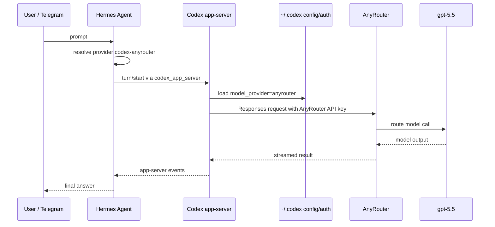

# Hermes AnyRoute Codex Skill

这个仓库整理的是一条明确的 VPS 中转链路：

```text
用户入口（Telegram / Hermes CLI）
  -> Hermes Agent
  -> Hermes provider: codex-anyrouter
  -> Hermes runtime: codex_app_server
  -> 本机 Codex CLI / Codex app-server
  -> Codex 读取 ~/.codex/config.toml 和 ~/.codex/auth.json
  -> AnyRoute / AnyRouter https://anyrouter.top/v1
  -> gpt-5.5
```

核心原则：**不要让 Hermes 直接打 AnyRouter。** Hermes 只负责会话、Gateway、技能和工具外壳；真正连接 AnyRouter 的请求交给 VPS 本机的 Codex runtime，由 Codex 使用自己的配置和 API key。


## 当前 VPS 自检结果

最近一次 live 自检结果：

| 层级 | 结果 | 说明 |
| --- | --- | --- |
| AnyRouter `/models` | PASS | HTTP 200，返回 15 个模型，包含 `gpt-5.5` |
| Codex CLI | PASS | `codex exec ... '只回复 OK'` 返回 `OK` |
| Hermes 主链路 | PASS | `hermes chat --provider codex-anyrouter ...` 返回 `OK` |
| Runtime 解析 | PASS | `codex-anyrouter` 解析为 `api_mode=codex_app_server` |
| Gateway | PASS | `hermes-gateway.service` active/running，Telegram connected |

这证明当前可用链路是：

```text
Hermes -> Codex app-server -> Codex AnyRouter config -> AnyRouter -> gpt-5.5
```

这不等于证明 `Hermes -> AnyRouter direct Responses API` 兼容。直接打 AnyRouter 的请求形状仍然可能失败，应该和这条 Codex 桥接链路分开判断。

## 为什么要这样架设

AnyRouter 与 Codex 的 Responses wire API 细节由 Codex CLI 维护。Hermes 如果直接用自己的 `codex_responses` 请求形状打 AnyRouter，可能遇到 `invalid codex request`、`invalid_responses_request` 或 new-api panic 之类的问题。

使用 Codex app-server 后，Hermes 不再自己拼 AnyRouter 请求，而是把整轮对话交给本机 Codex：



## 文件分工

| 文件 | 作用 | 是否放真实密钥 |
| --- | --- | --- |
| `~/.codex/config.toml` | 告诉 Codex 使用 AnyRouter provider、base URL、wire API 和默认模型 | 否 |
| `~/.codex/auth.json` | 保存 Codex CLI 使用的 AnyRouter API key | 是，本机私有文件 |
| `~/.hermes/config.yaml` | 告诉 Hermes 默认 provider 是 `codex-anyrouter` | 可有本机私有 key，但不要提交 |
| 这个技能仓库 | 文档、自检脚本、故障定位说明 | 否 |

不要把真实 API key、GitHub token、Telegram token 写进 README、SKILL.md、提交记录或 issue。

## Codex 配置

`~/.codex/config.toml` 的关键形态：

```toml
model = "gpt-5.5"
model_provider = "anyrouter"
preferred_auth_method = "apikey"
approval_policy = "never"
sandbox_mode = "danger-full-access"

[model_providers.anyrouter]
name = "Any Router"
base_url = "https://anyrouter.top/v1"
wire_api = "responses"
```

`~/.codex/auth.json` 保存 AnyRouter key，示例只写占位符：

```json
{
  "OPENAI_API_KEY": "sk-REPLACE_WITH_ANYROUTER_KEY"
}
```

检查 Codex 是否可用：

```bash
codex --version
codex exec -C /tmp --skip-git-repo-check --ephemeral --model gpt-5.5 '只回复 OK，不要解释。'
```

如果 Codex 输出 `chatgpt authentication required to sync remote plugins; api key auth is not supported`，但模型回答仍然成功，这通常只是 API-key 模式下同步 ChatGPT 插件目录的警告，不是主链路故障。

## Hermes 配置

当前 VPS 使用一个命名 provider：

```yaml
model:
  default: gpt-5.5
  provider: codex-anyrouter
  api_mode: codex_responses
  openai_runtime: auto

providers:
  codex-anyrouter:
    name: Codex AnyRouter
    base_url: https://anyrouter.top/v1
    api_key: sk-REPLACE_WITH_ANYROUTER_KEY
    default_model: gpt-5.5
    api_mode: codex_responses
```

看起来这里写的是 `api_mode: codex_responses`，但当前 Hermes 修改版对 `codex-anyrouter` 做了特殊解析：只要 provider 是 `codex-anyrouter`，最终 runtime 会改写成 `codex_app_server`。可以用下面命令确认：

```bash
python3 - <<'PY'
from hermes_cli.runtime_provider import resolve_runtime_provider
res = resolve_runtime_provider(requested="codex-anyrouter")
for key in ("provider", "model", "base_url", "api_mode", "source"):
    print(f"{key}: {res.get(key)}")
PY
```

期望看到：

```text
provider: codex-anyrouter
model: gpt-5.5
base_url: https://anyrouter.top/v1
api_mode: codex_app_server
source: custom_provider:Codex AnyRouter:codex_app_server
```

如果 `api_mode` 不是 `codex_app_server`，Hermes 可能正在绕过 Codex 直接打 AnyRouter，需要先修正 runtime 解析再做 live 测试。

## 安装技能

把技能目录复制到 Hermes 用户技能目录：

```bash
mkdir -p ~/.hermes/skills/devops
cp -R skill/hermes-anyroute-codex-skill ~/.hermes/skills/devops/
```

之后遇到 AnyRoute、AnyRouter、Codex app-server、Hermes provider 路由排查时，Hermes/Codex 可以使用这个技能里的流程和脚本。

## 一键自检

默认模式只读配置并脱敏输出：

```bash
python3 skill/hermes-anyroute-codex-skill/scripts/check_anyroute_codex.py
```

live 模式会调用上游服务，可能消耗少量额度：

```bash
python3 skill/hermes-anyroute-codex-skill/scripts/check_anyroute_codex.py --live
```

包含 Gateway 只读状态：

```bash
python3 skill/hermes-anyroute-codex-skill/scripts/check_anyroute_codex.py --live --gateway
```

输出最后会有汇总表：

```text
## Summary
PASS  Codex config uses AnyRouter API-key mode
PASS  Hermes provider is codex-anyrouter
PASS  Runtime resolves to codex_app_server
PASS  AnyRouter /models contains gpt-5.5
PASS  Codex CLI returned OK
PASS  Hermes returned OK via codex-anyrouter
```

## 分层手动验证

按这个顺序查，能避免把故障定位到错误层。

1. AnyRouter 是否在线、模型是否存在：

```bash
python3 skill/hermes-anyroute-codex-skill/scripts/check_anyroute_codex.py --live --skip-codex --skip-hermes
```

2. Codex 是否能通过 AnyRouter 回答：

```bash
codex exec -C /tmp --skip-git-repo-check --ephemeral --model gpt-5.5 '只回复 OK，不要解释。'
```

3. Hermes 是否通过 Codex 桥接链路回答：

```bash
hermes chat -q '只回复 OK，不要解释。' \
  --provider codex-anyrouter \
  -m gpt-5.5 \
  -t '' \
  -Q \
  --max-turns 1 \
  --source tool
```

4. Gateway 是否在线：

```bash
systemctl is-active hermes-gateway.service
systemctl show hermes-gateway.service -p ActiveState -p SubState -p ExecMainPID --no-pager
```

Gateway connected 只说明 Telegram/API server 传输层在线，不证明模型链路可用。模型 smoke 成功也不等于 Telegram 投递已验证。Telegram 端到端发消息属于外部副作用，通常单独确认。

## 故障定位表

| 现象 | 更可能的问题层 | 处理方式 |
| --- | --- | --- |
| `/models` 不含 `gpt-5.5` | AnyRouter 账号、额度、模型名或路由 | 先确认 AnyRouter 后台和模型 ID |
| `codex exec` 失败，Hermes 也失败 | Codex -> AnyRouter | 查 `~/.codex/config.toml`、`~/.codex/auth.json`、AnyRouter key |
| `codex exec` 成功，Hermes 失败 | Hermes -> Codex runtime | 查 `codex-anyrouter` 是否解析为 `codex_app_server` |
| Hermes 返回 `invalid codex request` | Hermes 可能直连 AnyRouter | 不要走 direct Responses，改回 Codex app-server |
| `429`、`503`、`high demand`、`stream disconnected` | AnyRouter 或上游拥塞 | 降低并发、稍后重试、临时切到其它 provider |
| ChatGPT plugin 401 警告，但回答 OK | Codex API-key 模式的非致命插件同步警告 | 忽略，不要误判成需要 `codex login` |
| 辅助任务报 `openai-codex` 500 | 标题、压缩、记忆、技能回顾等辅助链路 | 和主模型链路分开处理 |

## 技能目录结构

```text
skill/hermes-anyroute-codex-skill/
  SKILL.md
  agents/openai.yaml
  scripts/check_anyroute_codex.py
  references/setup-blueprint.md
  references/error-map.md
  assets/anyroute-codex-hermes-flow.svg
```

## 可选生成式配图提示词

仓库里已经有一张可直接在 GitHub 渲染的 SVG 流程图。如果后续想换成生成式封面图，可以把下面提示词交给图像模型，然后把生成结果放到 `skill/hermes-anyroute-codex-skill/assets/`：

```text
Create a clean technical architecture illustration for a GitHub README.
Subject: a VPS-hosted AI routing chain where Telegram or Hermes CLI sends a prompt to Hermes Agent, Hermes delegates to local Codex app-server, Codex reads ~/.codex/config.toml and ~/.codex/auth.json, then calls AnyRouter /v1 and routes to gpt-5.5.
Style: modern flat vector-like infographic, light background, crisp lines, readable labels, no mascots, no decorative blobs, no fake UI screenshots.
Required labels: "Telegram / Hermes CLI", "Hermes Agent", "provider: codex-anyrouter", "runtime: codex_app_server", "Codex app-server", "~/.codex/config.toml", "~/.codex/auth.json", "AnyRouter /v1", "gpt-5.5".
Composition: left-to-right pipeline with arrows, one small warning callout saying "Do not bypass Codex with direct Hermes -> AnyRouter Responses calls".
Aspect ratio: 16:9.
No secrets, no real API keys, no logos unless legally safe.
```

## 安全约定

- 不提交真实 API key、GitHub token、Telegram token、OAuth token、cookie 或 raw `Authorization` header。
- 自检脚本会脱敏常见 secret，但仍不要把完整命令输出贴到公开 issue。
- 改 `~/.hermes/config.yaml` 前先备份；如果切 runtime 失败，恢复旧配置再结束。
- 不要把一次 Gateway connected 当成模型链路成功；至少跑一次 Hermes `OK` smoke。
