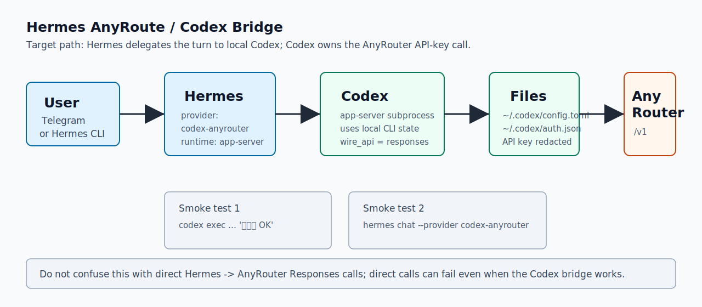

# Hermes AnyRoute Codex Skill

这个仓库把 VPS 上的 AnyRoute/AnyRouter -> Codex -> Hermes Agent 架设方式整理成一个可安装技能，并附带一套可复用的自检脚本。



## 这套架构解决什么问题

目标不是让 Hermes 直接调用 AnyRouter，而是让 Hermes 把主模型回合交给 VPS 本机的 Codex runtime：

```text
Telegram / Hermes CLI
  -> Hermes Agent
  -> provider: codex-anyrouter
  -> api_mode: codex_app_server
  -> local Codex CLI config
  -> AnyRouter
  -> gpt-5.5
```

这样做的核心收益是：AnyRouter 的 API key 和 wire API 兼容细节由 Codex CLI 承担，Hermes 只负责 gateway、会话、工具外壳和消息投递。

## 安装技能

把技能目录安装到 Hermes 的用户技能目录：

```bash
mkdir -p ~/.hermes/skills/devops
cp -R skill/hermes-anyroute-codex-skill ~/.hermes/skills/devops/
```

之后可以在 Hermes 里显式调用这个技能，或让 Hermes 在遇到 AnyRoute/Codex/AnyRouter 路由排查任务时自动触发。

## 必要配置

Codex 侧负责真正连接 AnyRouter。`~/.codex/config.toml` 的关键形态应类似：

```toml
model = "gpt-5.5"
model_provider = "anyrouter"
preferred_auth_method = "apikey"

[model_providers.anyrouter]
name = "Any Router"
base_url = "https://anyrouter.top/v1"
wire_api = "responses"
```

`~/.codex/auth.json` 中保存 AnyRouter API key，字段通常是：

```json
{
  "OPENAI_API_KEY": "sk-..."
}
```

Hermes 侧使用一个 named provider，例如：

```yaml
model:
  default: gpt-5.5
  provider: codex-anyrouter
  api_mode: codex_responses
  openai_runtime: auto

providers:
  codex-anyrouter:
    name: Codex AnyRouter
    base_url: https://anyrouter.top/v1
    api_key: sk-...
    default_model: gpt-5.5
    api_mode: codex_responses
```

在当前 Hermes 修改版中，`codex-anyrouter` 是特殊 provider：即使 `openai_runtime` 是 `auto`，也会被解析为 `codex_app_server`。这点很关键，因为它避免 Hermes 用自己的 direct Responses 请求形状直接打 AnyRouter。

## 自检流程

默认自检只读配置并脱敏输出：

```bash
python3 skill/hermes-anyroute-codex-skill/scripts/check_anyroute_codex.py
```

完整 live 自检会调用 AnyRouter、Codex CLI 和 Hermes CLI，可能消耗上游额度：

```bash
python3 skill/hermes-anyroute-codex-skill/scripts/check_anyroute_codex.py --live
```

手动分层检查：

```bash
codex exec -C /tmp --skip-git-repo-check --ephemeral --model gpt-5.5 '只回复 OK，不要解释。'

hermes chat -q '只回复 OK，不要解释。' \
  --provider codex-anyrouter \
  -m gpt-5.5 \
  -t '' \
  -Q \
  --max-turns 1 \
  --source tool
```

当前这台 VPS 的自检结果：

```text
AnyRouter /models: HTTP 200, models_count=15, includes gpt-5.5
Codex CLI -> AnyRouter: OK
Hermes -> codex-anyrouter -> Codex app-server -> AnyRouter: OK
Hermes gateway: active/running
Telegram gateway state: connected
```

## 常见误判

`chatgpt authentication required to sync remote plugins; api key auth is not supported`

这是 Codex API-key 模式下同步 ChatGPT 插件目录的警告。如果模型请求本身成功，它不是故障根因。

`invalid codex request` / `invalid_responses_request`

通常说明 Hermes 正在直接用 Responses 形状打 AnyRouter，而不是走 Codex app-server。检查 `codex-anyrouter` 是否解析到 `codex_app_server`。

`high demand` / `stream disconnected` / `429` / `503`

这是 AnyRouter 或上游路由拥塞。对于 API-key 模式，不要把它误判成需要 `codex login`。

Auxiliary 模型报 `openai-codex` / `chatgpt.com/backend-api/codex` 的 500

这可能是标题生成、压缩、技能回顾或记忆回顾的辅助调用失败，和主聊天链路不是同一层。主链路可以健康，同时辅助模型仍需单独切到更稳的 chat-completions provider。

## 仓库内容

```text
skill/hermes-anyroute-codex-skill/
  SKILL.md
  agents/openai.yaml
  scripts/check_anyroute_codex.py
  references/setup-blueprint.md
  references/error-map.md
  assets/anyroute-codex-hermes-flow.svg
```

## 安全约定

- 不把真实 API key、GitHub token、Telegram token 写进技能或 README。
- 自检脚本会脱敏常见 secret 形态。
- Telegram 端到端发消息属于外部副作用；没有明确要求时只读 gateway 状态和日志。
